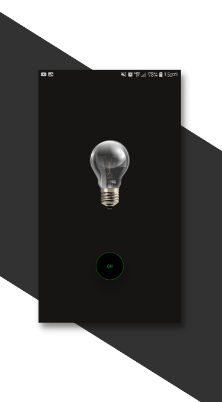
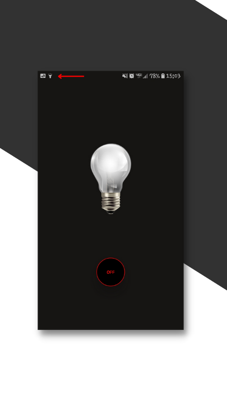

# FlashLight
 

#### Meus primeiros passos de desenvolvimento Mobile com React Native

 

### Projeto final do Bootcamp Decola Tech 3a edição
 
Neste projetinho aprendi a trabalhar com duas bibliotecas do React native, a primeira é para ligar e desligar o flashlight quando o botão ON ou OFF for apertado. Já a segunda é para fazer os dois eventos citados quando o telefone for chacoalhado. 

Flashlight OFF        | Flashlight ON
:-------------------------:|:-------------------------:
  |  